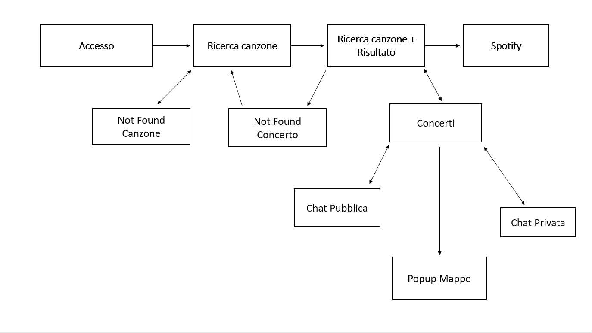
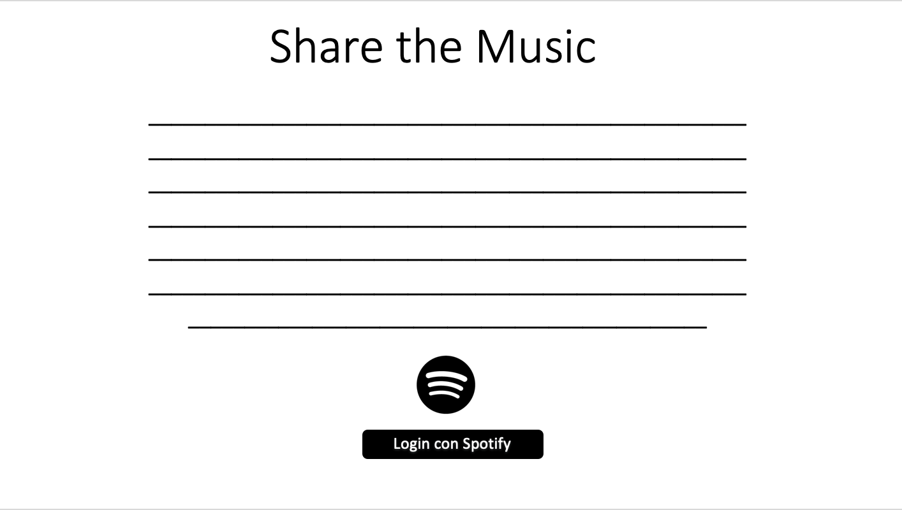
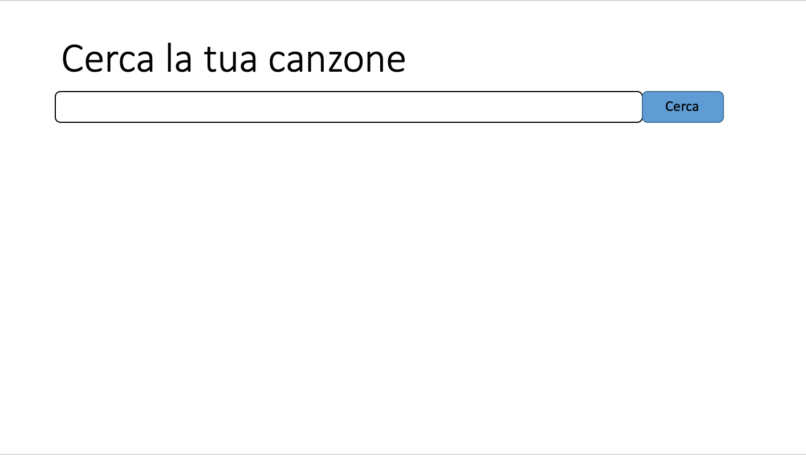
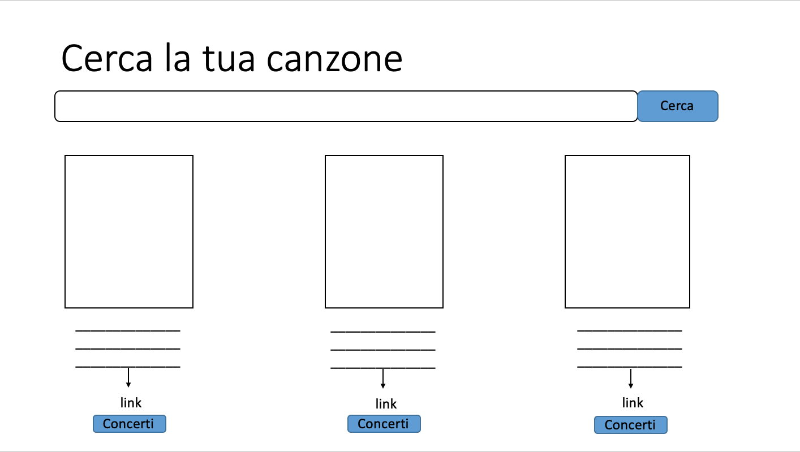
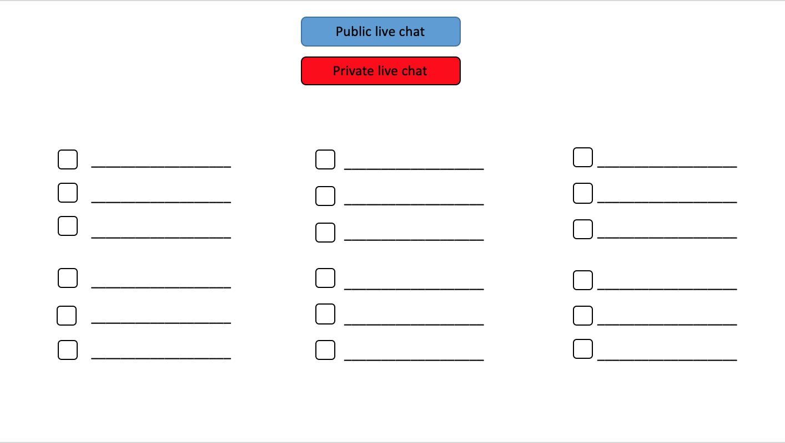
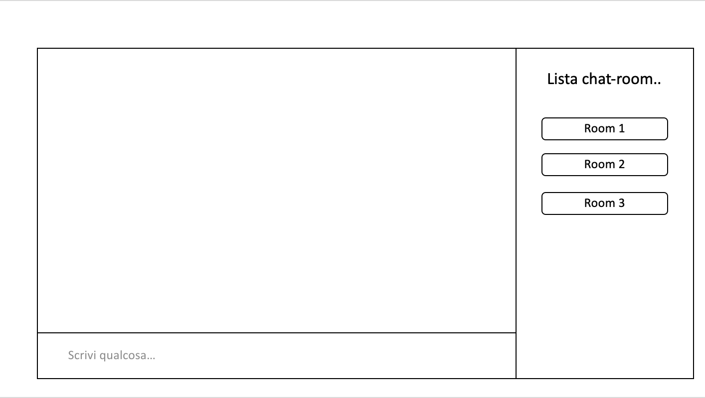
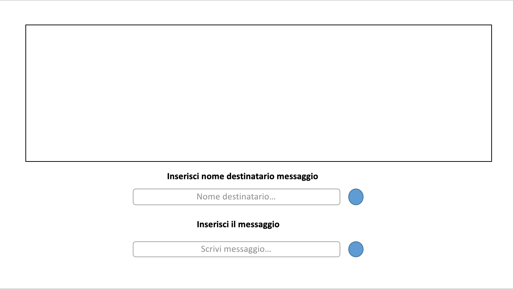

# Progetto RC - ShareTheMusic
Progetto per il corso di Reti di Calcolatori 2018/2019, tenuto dal prof. Andrea Vitaletti presso la Sapienza Università di Roma.

# Requisiti
1. Il servizio REST che implementate (lo chiameremo SERV) deve offrire delle API documentate (e.g. GET /sanlorenzo fornisce tutti i cinema di sanlorenzo)
2. SERV si deve interfacciare con almeno due servizi REST “esterni”, cioè non su localhost
3. Almeno uno dei servizi REST esterni deve essere “commerciale” (es: twitter, google, facebook, pubnub, parse, firbase etc)
4. Almeno uno dei servizi REST esterni deve richiedere oauth
5. Si devono usare Websocket e/o AMQP (o simili es MQTT)
6. Il progetto deve essere su GIT (GITHUB, GITLAB ...) e documentato con un README
7. Le API REST implementate in SERV devono essere documentate su GIT e devono essere validate con un caso di test 

# Tecnologie Utilizzate
* REST 1: Spotify (oAuth)
* REST 2: songkick (API concerti)
* REST 3: mapbox (API mappe)
* SocketIO: HTML5 (Chat pubblica e chat privata)
* Documentazione GitHub: MarkDown

# Idea del Progetto
Applicazione che, una volta eseguito il login tramite Spotify, permette all'utente di poter cercare canzoni. Il risultato della
ricerca (a condizione che la canzone esista) mostrerà all'utente tutte le info riguardanti la canzone cercata, il link di Spotify
alla canzone e in più, se disponibile, l'utente potrà ascoltarne una preview di 30 secondi.

Tramite il bottone "Cerca Concerti", che effettua una chiamata REST all'API di SongKick, si ottiene (se in programma) una lista
dei concerti relativi all'artista della canzone, con info su città, data e luogo dove si svolgerà il dato evento.

Cliccando sul luogo è possibile, tramite una chiamata REST all'API di MapBox, ottenere un popup di una mappa con un segnaposto
indicante il luogo dell'evento.

Sempre sulla pagina dei concerti è possibile usufruire di un servizio di chat privata o pubblica, create con l'idea di poter comunicare 
con gli altri utenti che hanno effettuato l'accesso per accordarsi per la compravendita dei biglietti di un concerto o, semplicemente,
per organizzarsi per andare insieme al concerto.

# Descrizione Pagine

**Accesso**

La pagina iniziale mostra il logo dell'applicazione seguito da una breve spiegazione di cosa fa il sito con accenno ai servizi
principali. Alla fine dell'introduzione c'è il bottone che permette l'accesso a Spotify. Una volta eseguito il login, l'utente
verrà reindirizzato alla pagina di "Ricerca Canzone".

**Ricerca**

La pagina presenta una semplice barra di ricerca dove andrà inserito il nome della canzone o dell'artista desiderato. Se questi
ultimi esistono, allora l'utente verrà reindirizzato alla pagina "Ricerca+Risultato", in caso contrario comparirà una pagina 
"404Traccia" che sta ad indicare che la ricerca eseguita non ha portato ad alcun risultato.

**Risultato**

La pagina presenterà ancora la barra di ricerca, utilizzabile nel caso in cui l'utente volesse cominciare una nuova ricerca, e 
tutti i risultati prodotti dalla ricerca precedente.
Ogni canzone trovata sarà costituita dalla copertina dell'album, il titolo della canzone, il nome dell'artista e il nome dell'album.
Inoltre, se disponibile, si potrà ascoltare una preview di 30 secondi della canzone.
Di seguito si avrà il link a Spotify, che permetterà di ascoltare l'intera canzone sulla piattaforma Spotify.
Infine si ha il bottone "Cerca Concerti" tramite il quale si viene reindirizzati, se vi sono concerti in programma, alla pagina "Concerti", altrimenti, alla pagina "404Concerti" se la ricerca non ha portato alcun risultato.

**Concerti**

La pagina conterrà una lista di concerti con le relative informazioni riguardanti città e stato, data e luogo del concerto in 
questione. Cliccando sul luogo è possibile ottenere un popup di una mappa con un segnaposto indicante il luogo dell'evento.
In cima alla pagina si trovano due bottoni "Public Live Chat" e "Private Live Chat" che rimanderanno rispettivamente alle pagine
"Chat Pubblica" e "Chat Privata" (cliccando sul bottone della chat pubblica verrò reindirizzato direttamente nella ChatRoom dell'artista).

**Chat Pubblica**

La pagina è costituita da una ChatBox e una text area dove inserire il messaggio (Cliccando il bottone "?" ricevo info sui comandi
da poter utilizzare nella chat).
Sulla destra si avrà una lista di ChatRoom dove sarà indicato anche il numero di utenti online in essa.
L'utente inizialmente si ritroverà all'interno della ChatRoom dell'artista cercato precedentemente, ma può decidere anche di 
accedere ad una ChatRoom già esistente o crearne una nuova (/join nomechat).
Se un utente entra o esce da una ChatRoom, la lista delle room viene aggiornata automaticamente (eliminazione ChatRoom, aggiornamento
numero utenti, alert("nomeutente è entrato nella room", ecc.)
Se in una chat, fatta accezione per quella aperta di default, non vi sono utenti, questa verrà automaticamente cancellata.

**Chat Privata**

La pagina presenta una ChatBox, una text area dove inserire il nickname della persona con cui si vuole comunicare, un bottone
identificativo per l'utente loggato, una text area dove inserire il messaggio e il bottone d'invio.
Per poter comunicare con un altro utente è necessario però che anche quest'ultimo abbia fatto accesso alla chat privata.

